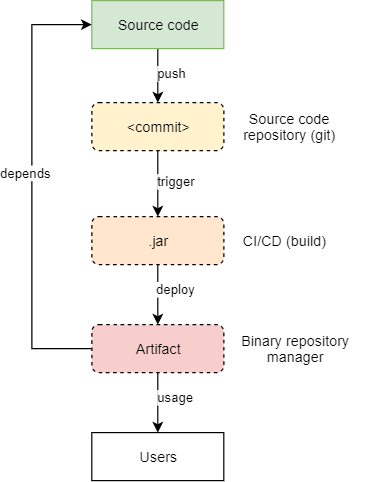
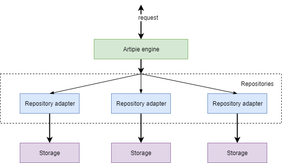
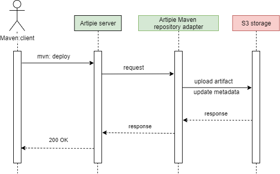

<h1 style="text-align: center;">Artipie – free binary repository manager</h1>

## Easy way to get your own binary repository

## Introduction

Binary Repository Manager (**BRM**), according to [Wikipedia](https://en.wikipedia.org/wiki/Software_repository), is “a software tool designed to optimize the download and storage of binary files used and produced in software development”, such as `.jar`, `.tar` or `.zip` archives. Being a critical component of most [DevOps toolchains](https://en.wikipedia.org/wiki/DevOps_toolchain), BRM resides right after the build pipeline. It is why it is sometimes called “build repository”, “artifact repository” or “pipeline state repository”.

A traditional DevOps pipeline expects the source code that is automatically validated, tested, packaged and versioned into an artifact (a binary file). Then, the artifact must be stored outside of the source code repository and available for later stages of the continuous delivery pipeline. Being a central point for management of binaries and dependencies, and an integrated depot for build promotions of internally developed software, the BRM is supposed to host these artifacts.

<div style="text-align:center">
    
    <br>
    Picture 1. The delivery pipeline of an average software development team
</div>


A software project of almost any size needs to keep its binary artifacts in a repository to enable access to them by programmers or by tools that ensure Continuous Integration (**CI**), Delivery (**CDL**) and Deployment (**CDP**). Since the quality of the software that manages the repository matters, the BRM should meet such requirements as:
* Integrability–there are plenty of build automation tools for each programming language, like Maven for Java, Npm for JavaScript, or Rake for Ruby. There are also many continuous integration tools, like Jenkins or Travis. Since automation is the most important aspect of DevOps, it is expected to have plugins for each or most of them, enabling seamless integration with the BRM.
* Availability–artifacts are important components of a software development process and they must be available to a programmer or a build tool immediately when needed, without even minor delays, and delivered at the highest possible speed.
* Scalability–most build artifacts are large binary files; some of them may be larger than 1Gb, for example Docker images or `.war` (production-ready Java archives). The BRM must be able to maintain large data sets, up to almost no size limitation.
* Reliability–an ability to corrupt the data because of software or hardware failures must be excluded as much as it is possible.

## Artipie

Artipie is a free binary artifact management tool. Artipie is not just a binary artifact web server - it's an artifact management constructor, which comprises many components built into server assembly. It is an open-source project that started in 2020 and is actively growing for now.

All Artipie components are based on reactive, asynchronous, non-blocking, and back-pressured streams and principles, allowing Artipie to withstand heavy workloads with a small amount of kernel threads.

The Artipie architecture consists of 3 essential parts:
1. Artipie HTTP engine
2. Repository adapters
3. Storages

<div style="text-align:center">
    
    <br>
    Picture 2. Artipie structure
</div>

### Artipie HTTP engine

Artipie engine is a Java application, which exposes an HTTP endpoint for repository access and management operations. It routes HTTP requests to the repository adapter and provides authentication mechanisms. The Artipie HTTP engine built on Vert.x and RxJava frameworks provides a lightweight, flexibility, and scalability to the project through asynchronous, reactive and non-blocking operation.

The most common data flow for the Artipie upload action is as follows: the client is sending some binary artifact to the server, which finds a responsible repository adapter to process the request; the repository adapter saves the stream to the storage; after completing, it updates a metadata of the repository (some repositories works differently, for example, Docker uses metadata as a path).

<div style="text-align:center">
    
    <br>
    Picture 3. Upload action for Artipie Maven repository with S3 implementation for storage
</div>

### Repository adapters

Repository adapters are independent projects, aimed at implementing an API to interact with the repository client and meta information generation layers for a specific package type (npm, maven, etc.). The Artipie engine uses adapters in order to provide BRM functionality. Each repository adapter encapsulates storage API to access binary blobs and metadata files.

Artipie supports the following types of repositories:
* Docker - private Docker registry for images.
*  Maven - Java, Kotlin, Groovy, Scala, Clojure artifacts and dependencies of varying types like a `.jar`, `.war`, `.klib` and etc.
*  NPM - JavaScript code sharing and packages store.
*  PyPI - Python packages index.
*  Anaconda - built packages for data science for Python, R, Lua, C, C++, etc.
*  RPM - .rpm packages repository for RHEL, PCLinuxOS, Fedora, AlmaLinux, CentOS, openSUSE, OpenMandriva, Oracle Linux, etc.
*  Gem - RubyGem hosting service for Ruby.
*  Go - Go packages storages.
*  Files (binary) storage - host any files you like.
*  Helm - Helm charts repository.
*  NuGet - hosting service for .NET packages.
*  Debian - package repository for Debian-based Linux distributions: Ubuntu, MX Linux, Mint, Raspberry Pi OS, Parrot OS, etc.
*  Composer - package source for PHP packages.

The number of adapters is constantly growing, and you can see future adapters in the [Artipie roadmap](https://github.com/orgs/artipie/projects/3). 

### Storages

Repository adapters place the uploaded and created binary files in the storage. Artipie has the Abstract storage that provides an abstraction over a physical data storage system. The simplicity makes it easy to implement the interface for almost any data storage system. It has two major operations: to put and get an item from storage with a few additional functions, such as to check if an item exists, to list storage items, or to obtain the item metadata.

At the moment, there are the following storage implementations:
1. File system storage
2. Redis storage
3. S3 based storage

Abstract storage also provides an interface that can be extended and implemented to support any type of storage you need.

## Start using Artipie

You have two options for working with Artipie:
* Run [Artipie Docker image with Docker Compose](https://github.com/artipie/artipie#quickstart);
* Run [Artipie jar archive](https://github.com/artipie/artipie#quickstart) on JVM.

I will show a simple example of how to run Artipie locally with Docker Compose and configure it as a repository for Docker images on a Windows machine.

### Preparing

To run Artipie, you need to have [Docker installed](https://docker.com/get-started), then you can simply clone this repository with example on the path `C:\ `, or follow the steps:
1. Make a folder for the Artipie project (e.g. `C:\artipie`)
2. Create a folder for the Artipie configuration (e.g. `C:\artipie\config`) and place in the folder the yml file with the Artipie server configuration. In my example, the file is called `artipie.yml`. You must specify the path where Artipie will find all repository configurations. I specify the configuration path of the Docker repository as `var/artipie/repo`, because I mount the folder from the local Windows machine `C:\artipie\repo` to directory `/var/artipie/repo` in Artipie Docker container, when setting-up `docker-compose.yml` in step №4.
```yaml
meta:
  storage:
    type: fs
    path: /var/artipie/repo #path to repository configurations
  layout: flat
```
3. Create a folder for the repository configuration files (e.g. `C:\artipie\repo`), then put in the folder the yml file with the repository configuration. The name of this file will be the name of the repository to be created. For example, the file will be named `my-docker.yml` and the repository will be named **my-docker** accordingly. To configure a storage with FileStorage type, it is enough to set the path where Artipie will store all the items. System must read and write permissions to create files on this path. In my example, the path will be `/var/artipie/images`.
```yaml
repo:
  type: docker
  storage:
    type: fs   #type = FileStorage
    path: /var/artipie/images   #place where the data will be stored
```
4. Create file `docker-compose.yml` with next instructions:
```yaml 
version: "3.3"
services:
  artipie:
    image: artipie/artipie:latest
    container_name: artipie
    restart: unless-stopped
    ports:
      - "8080:8080"
    volumes:
      - /C/artipie/repo:/var/artipie/repo # mount folder with repository configuration
      - /C/artipie/config:/etc/artipie/ # mount folder with Artipie server configuration
```

### Launch

Now, open CLI, go to the folder with the `docker-compose.yml` file and start Artipie with the console command: **docker-compose up**.
In the CLI, we see that Artipie has started on port 8080 and found a repository configuration file `my-docker.yml`.
```cmd
C:\>cd C:/artipie
C:\artipie>docker-compose up
[+] Running 2/2
 - Network artipie_default  Created                              0.7s
 - Container artipie        Created                              0.1s
Attaching to artipie
...
artipie  | [INFO] main com.artipie.VertxMain - Artipie was started on port 8080
artipie  | [INFO] ForkJoinPool.commonPool-worker-1 com.artipie.asto.fs.FileStorage - Found 1 objects by the prefix "" in /var/artipie/repo by /var/artipie/repo: [my-docker.yml]
...
```

### Usage

Before pushing any images, let's pull an existing one from Docker Hub. My choice is an alpine image. Pull the alpine image with the command: **docker pull alpine**:
```cmd
C:\artipie>docker pull alpine
Using default tag: latest
latest: Pulling from library/alpine
Digest: sha256:686d8c9dfa6f3ccfc8230bc3178d23f84eeaf7e457f36f271ab1acc53015037c
Status: Downloaded newer image for alpine:latest
docker.io/library/alpine:latest
```

With the next command, we create our docker image called _myfirstimage_ from the alpine image for pushing it to our Artipie repository:
**docker image tag alpine localhost:8080/my-docker/myfirstimage**. Check that docker has 2 images: _alpine_ and _localhost:8080/my-docker/myfirstimage_, with the command: **docker images**:
```cmd
C:\artipie>docker image tag alpine localhost:8080/my-docker/myfirstimage

C:\artipie>docker images
REPOSITORY                              TAG     IMAGE ID        CREATED         SIZE
localhost:8080/my-docker/myfirstimage   latest  e66264b98777    7 weeks ago     5.53MB
alpine                                  latest  e66264b98777    7 weeks ago     5.53MB
```

Now, we have to login into our own registry with the default user artipie|artipie, because the Docker registry supports only authorized users: **docker login --username artipie localhost:8080**:
```cmd
C:\artipie>docker login --username artipie localhost:8080
Password: artipie
Login Succeeded
```

Finally, we can push our image to the repository with the command: **docker push localhost:8080/my-docker/myfirstimage**:
```cmd
C:\artipie>docker push localhost:8080/my-docker/myfirstimage
Using default tag: latest
The push refers to repository [localhost:8080/my-docker/myfirstimage]
24302eb7d908: Pushed
latest: digest: sha256:4ff3ca91275773af45cb4b0834e12b7eb47d1c18f770a0b151381cd227f4c253 size: 528
```
For checking the result, we can attach to the container with command: **docker exec -it artipie bash** and go to `/var/artipie/images/my-docker` to find the docker folder with subfolders and blob files.
```cmd
C:\artipie>docker exec -it artipie bash
bash-4.4$ cd /var/artipie/images/my-docker/
bash-4.4$ ls
docker
```

Before pulling an image from our repository, remove the image from local docker images with the command: **docker image rm localhost:8080/my-docker/myfirstimage**.
Verify that the image was removed, and we have only 1 image (_alpine_): **docker images**
```cmd
C:\artipie>docker image rm localhost:8080/my-docker/myfirstimage
Untagged: localhost:8080/my-docker/myfirstimage:latest
Untagged: localhost:8080/my-docker/myfirstimage@sha256:4ff3ca91275773af45cb4b0834e12b7eb47d1c18f770a0b151381cd227f4c253

C:\artipie>docker images
REPOSITORY  TAG     IMAGE ID        CREATED         SIZE
alpine      latest  e66264b98777    7 weeks ago     5.53MB
```

The image can be pulled as well: **docker pull localhost:8080/my-docker/myfirstimage**. After executing the command, check that we have 2 images again (_alpine_ and _localhost:8080/my-docker/myfirstimage_): **docker images**:
```cmd
C:\artipie>docker pull localhost:8080/my-docker/myfirstimage
Using default tag: latest
latest: Pulling from my-docker/myfirstimage
Digest: sha256:4ff3ca91275773af45cb4b0834e12b7eb47d1c18f770a0b151381cd227f4c253
Status: Downloaded newer image for localhost:8080/my-docker/myfirstimage:latest
localhost:8080/my-docker/myfirstimage:latest

C:\artipie>docker images
REPOSITORY                              TAG     IMAGE ID        CREATED         SIZE
localhost:8080/my-docker/myfirstimage   latest  e66264b98777    7 weeks ago     5.53MB
alpine                                  latest  e66264b98777    7 weeks ago     5.53MB
```

## Conclusion

Binary repository is a key element in any DevOps pipeline and various projects need various types of binary repositories to store artifacts. Almost every programming language ecosystem has its own kind of artifact repository. The Artipie provides a wide range of adapters for the major packaging formats in one product, enabling the management of all artifacts from one place. Artipie is growing and developing rapidly, and it provides the ability to add the implementation of its own binary data storage, in addition to File, Redis and S3 storage.

Artipie is a good choice for storing binary artifacts because it is simple for configuration. It has support for many types of repositories. As an open-source product, it is absolutely free for use.

You can find more information about [Artipie on GitHub](https://github.com/artipie) or if you have any questions or suggestions contact us in the [Telegram](https://t.me/artipie).
